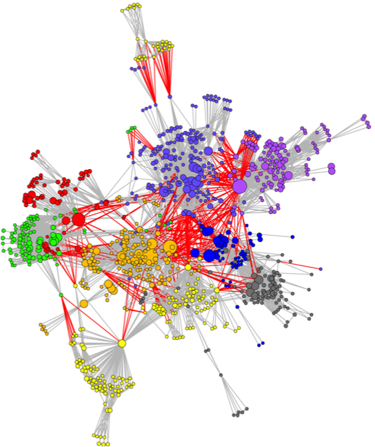

```{r setup, include=FALSE}
knitr::opts_chunk$set(echo = FALSE)
```

{width=50%}

Collaborators: David Berrigan, Annie Feng, Kara Hall, Stephen Marcus, Glen Morgan, Brooke Stipelman, Daniel Stokols, Amanda L. Vogel, Angela Zoss, Katy Börner

This project involves a series of bibliometric analyses and visualizations that aid in the evaluation of TTURC projects. Visualizations include geographic visualizations, co-authorship networks, Map of Science overlays, and keywords networks.

This research was supported in part by the National Cancer Institute at the National Institutes of Health [contract number HHSN261200800812].

