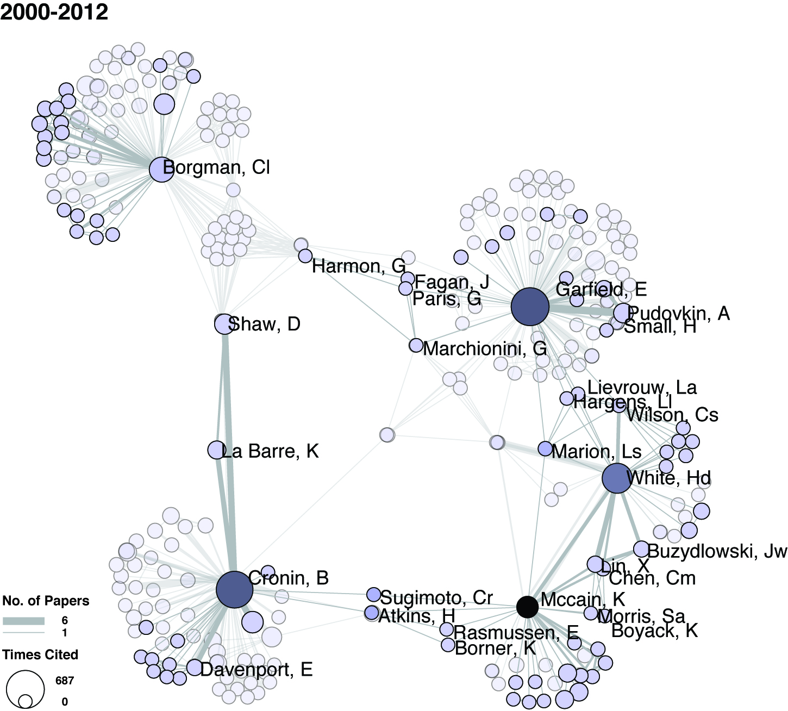

```{r setup, include=FALSE}
knitr::opts_chunk$set(echo = FALSE)
```

{width=50%}

Angela Zoss. (2012). Seeding a field: The growth of bibliometrics through co-authorship ties, Bulletin of the American Society for Information Science and Technology, 38(6), p. 29-32, Wiley Subscription Services, Inc., A Wiley Company, [url](http://doi.wiley.com/10.1002/bult.2012.1720380608), [doi:10.1002/bult.2012.1720380608](http://dx.doi.org/10.1002/bult.2012.1720380608)
