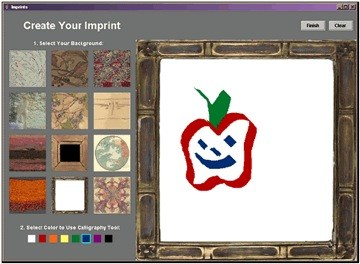

```{r setup, include=FALSE}
knitr::opts_chunk$set(echo = FALSE)
```

<video width="320" height="240" src="chimovie.mov" controls>



</video>

Personalization and social awareness, important aspects in the definition of a place, are traditionally overlooked in the design of technology for museums. We describe Imprints, a system to enhance the role of visitor participation beyond information receiver to active creator of sense of place. Overall response to the Imprints system is explored through interviews and log analysis of use. Despite some usability issues, response to the system was positive, and it was appropriated for both personalization and awareness of others. The results suggest an opportunity to introduce technology that plays with the dynamic between private expression and public presence in the traditional environment of the art museum.

## Responsibilities

- built Java drawing application to allow study participants to create custom avatars
- conducted observational research of system in use in the museum
- co-authored conference paper
- co-design poster

## Project Outcomes

-   Boehner, Kirsten, Thom-Santelli, Jenn, Zoss, Angela M., Gay, Geri, Barrett, Tucker and Hall, Justin S. (May 29, 2005). **Imprints in the Museum: Social Navigation Technology for Participatory Expression**. Poster presentation at International Communication Association (ICA) 2005, New York City, NY.

-   Boehner, Kirsten, Thom-Santelli, Jenn, Zoss, Angela, Gay, Geri, Hall, Justin S. and Barrett, Tucker. (2005). **Imprints of place: Creative expressions of the museum experience**. Paper presented at *ACM CHI 2005, Conference on Human Factors in Computing Systems*, Portland, OR. doi:[10.1145/1056808.1056881](https://dx.doi.org/10.1145/1056808.1056881)
