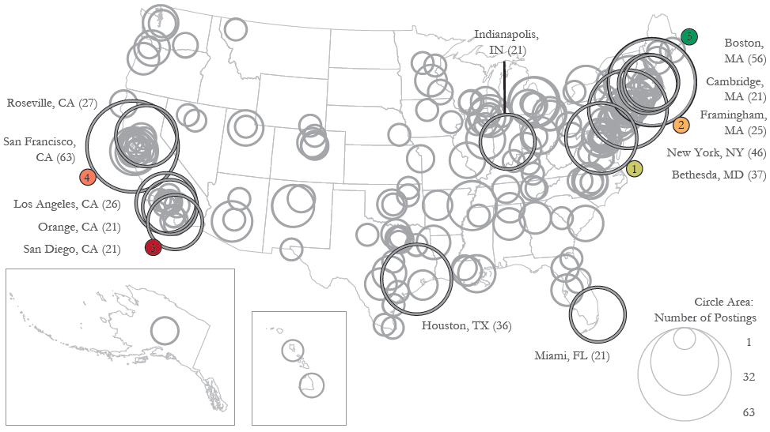

```{r setup, include=FALSE}
knitr::opts_chunk$set(echo = FALSE)
```

{width=50%}

*Collaborators: Angela Zoss, Michael Conover, Katy Börner*

In the [Job Map](http://mapjobs.cns.iu.edu/), job postings collected via RSS feeds are visualized geospatially and topically (overlaid on a Map of Science). Also accepted as a map to the [Places & Spaces: Mapping Science](http://scimaps.org/) exhibit, 6th iteration ([U.S. Job Market map](http://scimaps.org/maps/map/us_job_market_where__122/)).
