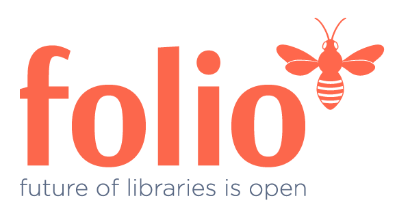

```{r setup, include=FALSE}
knitr::opts_chunk$set(echo = FALSE)
```

{width=50%}

*"FOLIO is a collaboration of libraries, developers and vendors building an open source library services platform. It supports traditional resource management functionality and can be extended into other institutional areas."* -[folio.org](https://www.folio.org/)

## Responsibilities

-   Since joining the Reporting Special Interest Group (SIG) in September 2018, have held progressively more advanced leadership roles. Currently a member of the Reporting SIG development leadership team, working as project manager for the RA/UM query subteam.
-   Responsibilities have included database testing, loading data, generating test data, writing queries for both PostgreSQL and Amazon Redshift databases, reviewing queries for logic and style, creating and maintaining JIRA issues and wiki documentation, and maintaining the GitHub repository.

## Project Outcomes

-   [Query Repository](https://github.com/folio-org/folio-analytics)
-   Nassib Nassar, Angela Zoss, Vandana Shah, Scott Perry, Axel Dörrer, Christie Thomas, Sharon Beltaine (July 15, 2020). FOLIO Forum livestream: [Reporting Community Update on Building Reports](https://www.youtube.com/watch?v=PvjKd1wrufA)
-   Zoss, Angela M. (March 9, 2020). [Building an Open Source Reporting Platform for FOLIO](https://www.dropbox.com/sh/mj11b52lglkb0ph/AAAr2PFKjf3Qs7Kin_LCwJPla?dl=0&preview=Angela+Zoss+-+P07-Building+an+Open+Source+Reporting+Platform+for+FOLIO.pptx). Poster presentation at [2020 Electronic Resources & Libraries Annual Conference (ER&L2020)](https://www.electroniclibrarian.org/2020-program/), Austin, TX. 
    [{width="500"}](poster_for_printing.png)
-   Nassib Nassar, Angela Zoss, Sharon Beltaine, Kevin Walker (February 12, 2020). FOLIO Forum livestream: [FOLIO Reporting with the Library Data Platform](https://www.youtube.com/watch?v=F3YT6tZTFl8)
