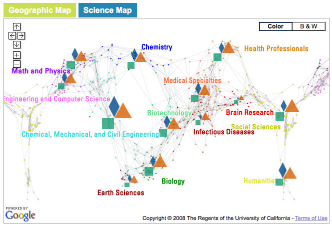

```{r setup, include=FALSE}
knitr::opts_chunk$set(echo = FALSE)
```

{width="50%"}

*Collaborators: Chin Hua Kong, Nianli Ma, Michael J. Stamper, Angela Zoss, Katy Börner*

[MapSustain](http://mapsustain.cns.iu.edu/), building off the [Job Map](http://angelazoss.com/?/projects/jobmap/), visualizes funding, publication, and patent data related to sustainability research on linked geospatial and topic maps.

## Project Outcomes

-   Stamper, Michael J., Kong, Chin Hua, Ma, Nianli, Zoss, Angela M. and Börner, Katy. (2011). [**MAPSustain: Visualising biomass and biofuel research**](http://hdl.handle.net/10919/86852). Paper presented at *Making Visible the Invisible: Art, Design and Science in Data Visualization*, University of Huddersfield, United Kingdom.
