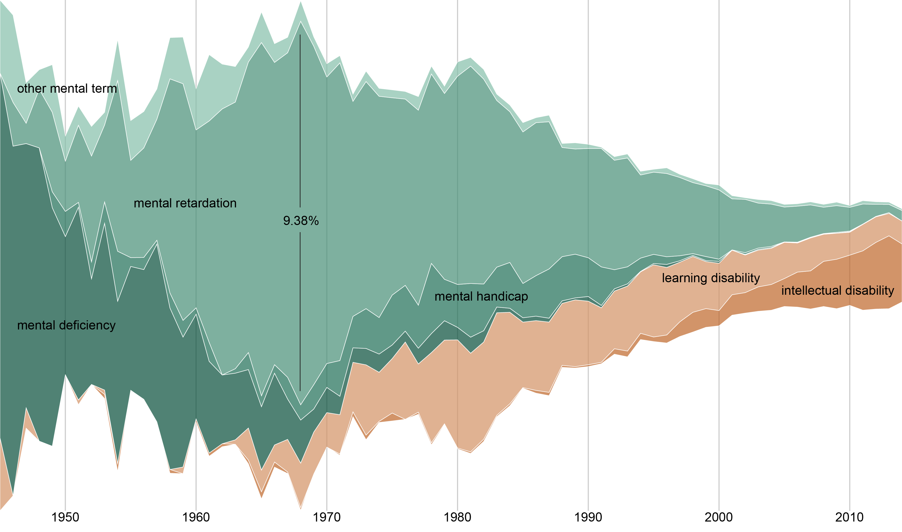

```{r setup, include=FALSE}
knitr::opts_chunk$set(echo = FALSE)
```

{width=50%}

Every decade brings changes in the perceptions of normal in mental health, as well as in how abnormal is labeled, understood, and dealt with. Neurosis, hysteria, and homosexuality are just a few examples of such changes. The shifts in terminology and classifications reflect our continuous struggle with social representations and treatment of the “other.” How could we best understand mental illness categorizations and become aware of their changes over time? In this paper, we seek to address this and other questions by applying an automated dictionary-based classification approach to the analysis of relevant research literature over time. We propose to examine the domain of mental health literature with an iterative workflow that combines large-scale data, an automated classifier, and visual analytics. We report on the early results of our analysis and discuss challenges and opportunities of using the workflow in domain analysis over time.

## Responsibilities

- created text analysis scripts in python to identify disorder terms in paper titles
- visualized processed output using Tableau and Raw
- co-authored paper on results

## Project Outcomes

- Inna Kouper, Angela Zoss, Trevor Edelblute, Michael Boyles, Hamid Ekbia. (2016). Mental Disorders Over Time: A Dictionary-Based Approach to the Analysis of Knowledge Domains, iConference 2016 Proceedings, iSchools, [url](https://www.ideals.illinois.edu/handle/2142/89299), [doi:10.9776/16303](http://dx.doi.org/10.9776/16303)
