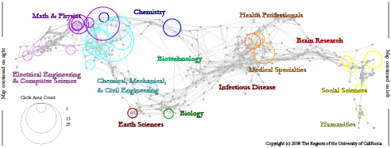

```{r setup, include=FALSE}
knitr::opts_chunk$set(echo = FALSE)
```

{width=50%}

*Collaborators: Angela Zoss, Katy Börner*

NSF CISE and SBE Advisory Committees contracted several teams to act as a subcommittee and help in identifying tools and approaches that would be effective for proposal analysis in order to better support Program Officers in short-term and long-term goals.

[White paper](http://ivl.slis.indiana.edu/km/pub/2010-borner-zoss-sbe-evolvepop.pdf)
