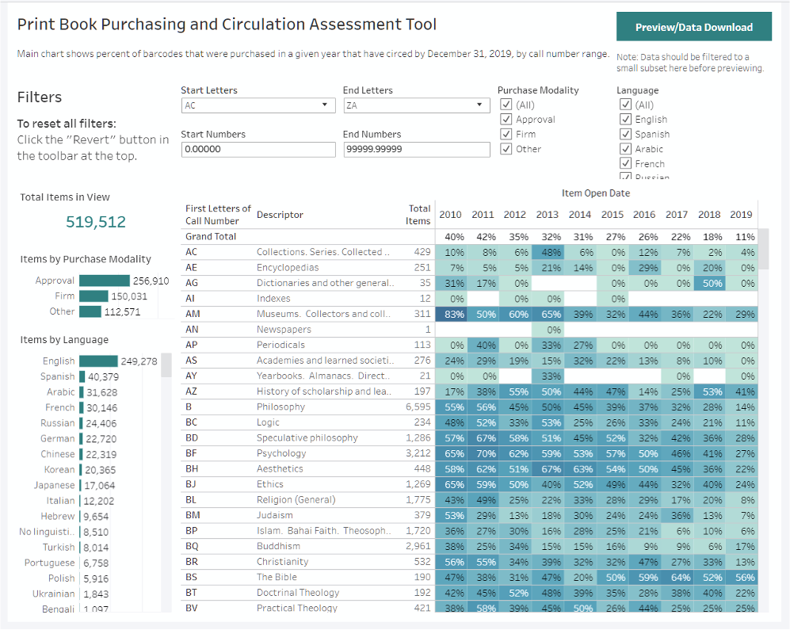
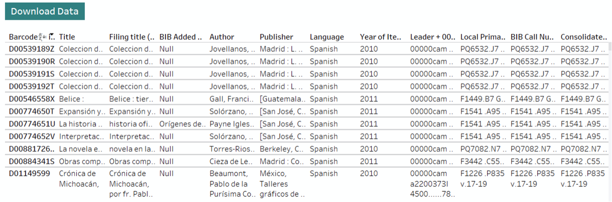
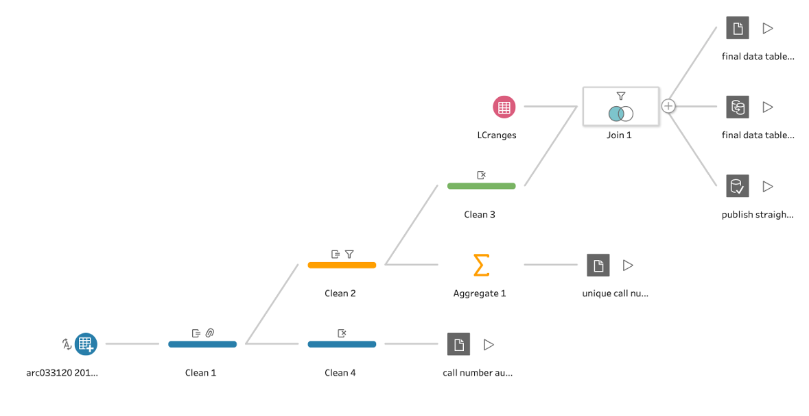

```{r setup, include=FALSE}
knitr::opts_chunk$set(echo = FALSE)
```



Analyzing usage of print materials is important for collection development, but the need for many years of data, and the plurality and variability of some data attributes, makes analysis challenging. In a cooperative effort between Collection Strategy and Development and Assessment and User Experience, Duke has developed a tool for exploring circulation of printed books. The resulting Tableau visualization allows high-level views and filtering by LC class, method of acquisition, year of acquisition, and language. Filtered views also allow users to download more comprehensive data for further analysis offline.

## Responsibilities

- Serve as technical lead for project
- Assist with requirements gathering and user feedback sessions
- Evaluate and select technical solutions for project requirements
- Build and test data processing workflow
- Build and test dashboard and download interface
- Contribute to project use and maintenance documentation

## Project Outcomes

- Kosokoff, Jeff & Zoss, Angela. (2020). Print Circs! A tool to inform understanding of 10 years of print acquisitions at Duke. Presentation at 2020 TRLN Annual Meeting, virtual.

## Additional Project Views




