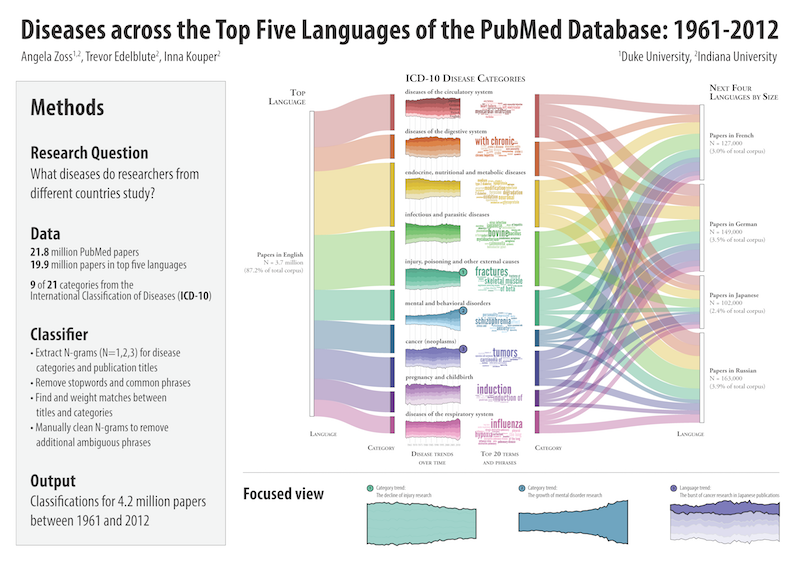

```{r setup, include=FALSE}
knitr::opts_chunk$set(echo = FALSE)
```

{width="50%"}

Zoss, Angela; Edelblute, Trevor; Kouper, Inna. (2014). Diseases across the Top Five Languages of the PubMed Database: 1961-2012. doi: [10.6084/m9.figshare.1033878](http://dx.doi.org/10.6084/m9.figshare.1033878)
