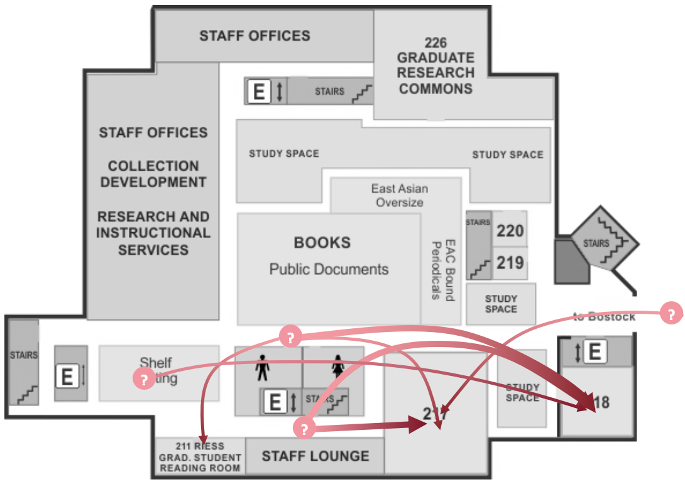
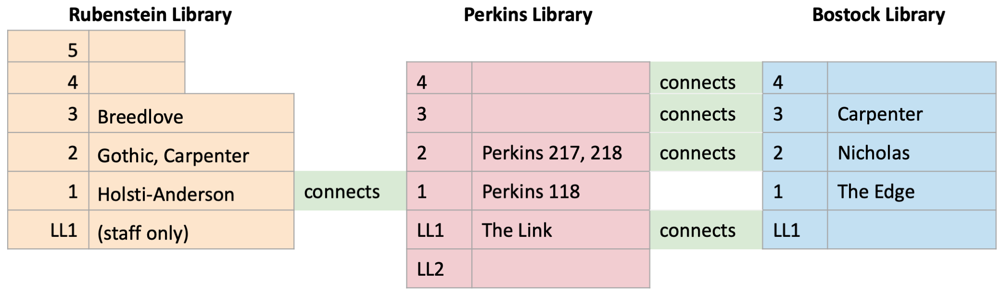
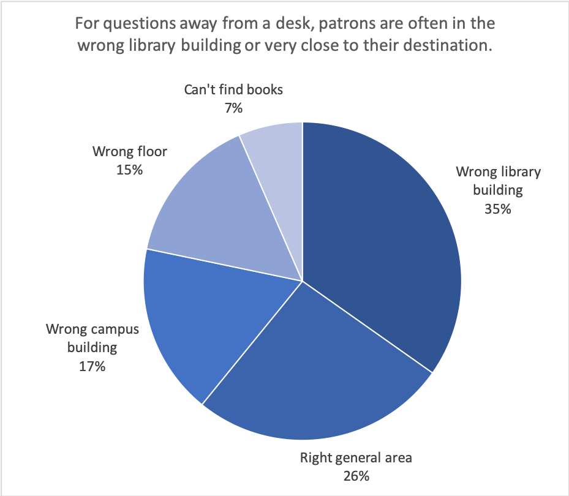

```{r setup, include=FALSE}
knitr::opts_chunk$set(echo = FALSE)
```



As a response to repeated feedback from patrons and staff about difficulties navigating our library spaces, Duke University Libraries undertook a study to explore patron wayfinding patterns. The study gathered data about patron wayfinding issues by surveying library staff -- a recognition that small-scale observational studies and self-reported concerns via patron surveys would result in only a small number of the situations where patrons frequently have trouble with navigation. The survey asked staff to report areas of our building where patrons typically find themselves lost and what location they are trying to find. Results of this survey were synthesized into a report making general recommendations about how to improve signage and wayfinding. A project to redesign signage in response to these findings is underway.

## Responsibilities

- Design, conduct, and analyze staff survey
- Summarize survey results in internal reports
- Serve as project lead for implementation of suggestions
- Develop proposal for building improvements, including phased and tiered project options
- Offer advice on related local graphic design work

## Project Outcomes

- Internal whitepaper (May 2019) and addendum (July 2019)
- Zoss, Angela M. (December 2019). [Where do patrons get lost? A study of library navigation.](https://blogs.library.duke.edu/bitstreams/2019/12/06/where-do-patrons-get-lost-a-study-of-library-navigation/). Blog post. 

## Additional Project Views



