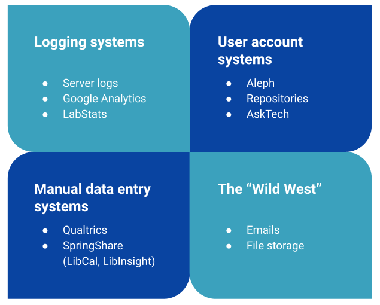

```{r setup, include=FALSE}
knitr::opts_chunk$set(echo = FALSE)
```



A multi-year effort to review and improve how the Duke University Libraries approach the collection, retention, and analysis of patron data. 

## Responsibilities

- Represented the Duke University Libraries at the September 2018 [National Web Privacy Forum](https://www.lib.montana.edu/privacy-forum/) at Montana State University Library
- With Joyce Chapman, conducted an audit of Duke's data systems and practices
- Chaired Data Privacy and Retention Task Force, guiding efforts to compose a statement on Duke University Libraries' priorities and principles related to patron privacy

## Project Outcomes

-   Forzetting, Sarah, Sidman, Angela and Zoss, Angela M. (March 11, 2020). [**Protecting patron privacy - what are the issues and what can we do?**](https://www.dropbox.com/sh/mj11b52lglkb0ph/AAAN1h_sSmLC68Tw-Qft60RUa/Angela%20Sidman%20-%20S81_Protecting_patron_privacy.pptx?dl=0). Panel presentation at 2020 Electronic Resources & Libraries Annual Conference (ER&L2020), Austin, TX.

-   Chapman, Joyce and Zoss, Angela M. (February 27, 2020). [**DUL Data Privacy & Retention Audit**](http://bit.ly/DULDataAudit). Presentation at Duke University Libraries -- Open Forum, Durham, NC.

-   Chapman, Joyce and Zoss, Angela M. (2020). [**Duke Libraries Data Privacy and Retention Audit Report**](https://hdl.handle.net/10161/20061). Public report on the results of a data privacy and retention audit conducted at Duke University Libraries in the fall of 2019.

-   Zoss, Angela M. (2018). Participant, [National Web Privacy Forum](https://www.lib.montana.edu/privacy-forum/). Bozeman, MT.
