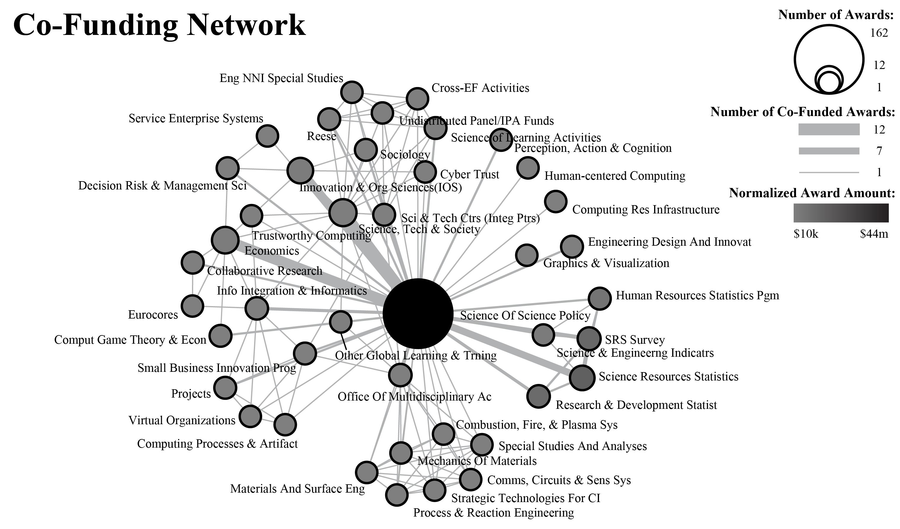

```{r setup, include=FALSE}
knitr::opts_chunk$set(echo = FALSE)
```

{width="50%"}

The Science of Science and Innovation Policy (SciSIP) program at the National Science Foundation (NSF) supports research designed to advance the scientific basis of science and innovation policy. The program was established at NSF in 2005 in response to a call from Dr. John Marburger III, then science advisor to the U.S. President, for a “science” of science policy. As of January 2011, it has co-funded 162 awards that aim to develop, improve, and expand data, analytical tools, and models that can be directly applied in the science policy decision making process. The long-term goals of the SciSIP program are to provide a scientifically rigorous and quantitative basis for science policy and to establish an international community of practice. The program has an active listserv that, as of January 2011, has almost 700 members from academia, government, and industry. This study analyzed all SciSIP awards (through January 2011) to identify existing collaboration networks and co-funding relations between SciSIP and other areas of science. In addition, listserv data was downloaded and analyzed to derive complementary discourse information. Key results include evidence of rich diversity in communication and funding networks and effective strategies for interlinking researcher and science policy makers, prompting discussion, and resource sharing.

## Responsibilities

- With support from advisor, conducted all analyses and created all visualizations related to this project
- Co-authored article and presentation on work

## Project Outcomes

-   Angela M. Zoss, Katy Börner. (2012). Mapping interactions within the evolving science of science and innovation policy community, Scientometrics 91(2), p. 631-644, Springer Netherlands, [url](http://link.springer.com/10.1007/s11192-011-0574-8), [doi:10.1007/s11192-011-0574-8](http://dx.doi.org/10.1007/s11192-011-0574-8)
-   Zoss, Angela M. and Börner, Katy. (July 6, 2011). **Mapping interactions within the evolving Science of Science and Innovation Policy community**. Accepted presentation at 13th International Society of Scientometrics and Informetrics (ISSI) conference, Durban, South Africa.
