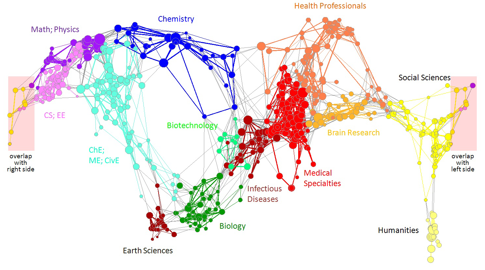

```{r setup, include=FALSE}
knitr::opts_chunk$set(echo = FALSE)
```

{width="50%"}

*Collaborators: Richard Klavans, Michael Patek, Joseph Biberstine, Vincent Larivière, Kevin W. Boyack, Katy Börner, Angela Zoss*

Global maps of science can be used as a reference system to chart career trajectories, the location of emerging research frontiers, or the expertise profiles of institutes or nations. This paper details data preparation, analysis, and layout performed when designing and subsequently updating the UCSD map of science and classification system.

## Responsibilities

- contributed materially to calculations and visualization output related to updating the map of science

## Project Outcomes

- Börner, K., Klavans, R., Patek, M., Zoss, A. M., Biberstine, J. R., Light, R. P., Larivière, V., & Boyack, K. W. (2012). [Design and update of a classification system: The UCSD Map of Science](http://dx.doi.org/10.1371/journal.pone.0039464). *PLoS ONE, 7*(7), e39464.
