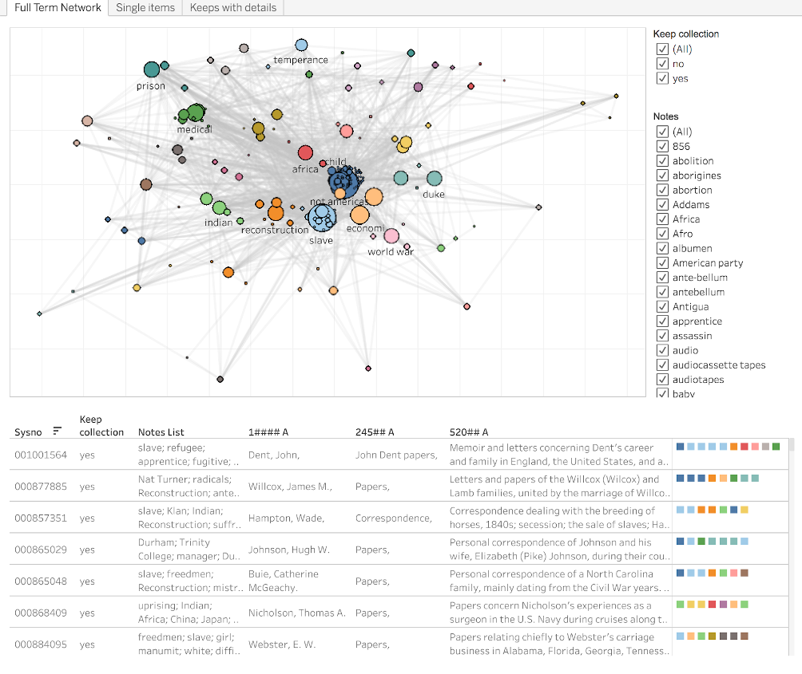

```{r setup, include=FALSE}
knitr::opts_chunk$set(echo = FALSE)
```



A project to process and visualize metadata from manuscript collections being considered for a re-description project.


## Responsibilities

- Processed manuscript metadata into a simple tabular format to facilitate manual keyword select
- Used manually selected keywords to further process metadata into a term co-occurrence network
- Created interactive dashboard combining tabular views of metadata with term co-occurrence network 

## Project Outcomes

-   Lyon, Meghan and Zoss, Angela M. (July 11, 2019). **Exploring and Visualizing Manuscript Metadata for Project Prioritization**. Presentation at 2019 TRLN Annual Meeting, Chapel Hill, NC.
