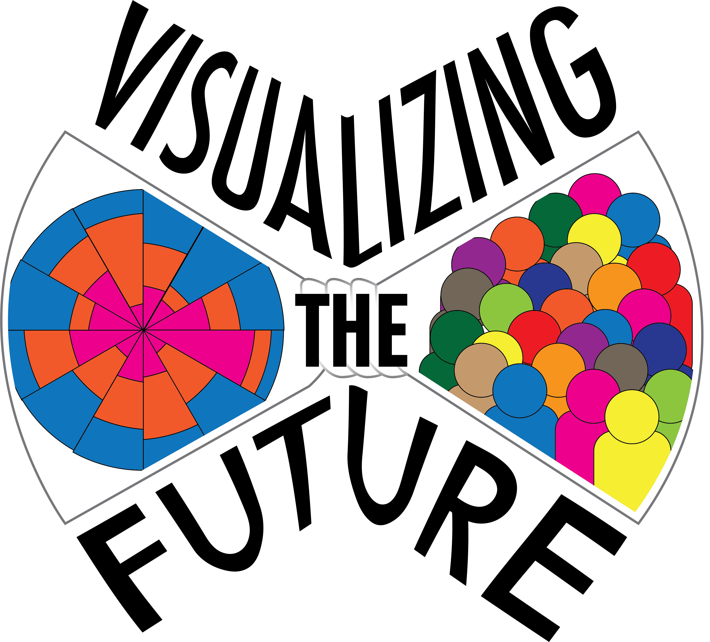

```{r setup, include=FALSE}
knitr::opts_chunk$set(echo = FALSE)
```

{width="50%"}

*A partnership between the University of Michigan, the University of Southern California, and Duke University, [Visualizing the Future](https://visualizingthefuture.github.io/) will gather current and aspiring specialists in data visualization to develop a literacy-based instructional and research agenda for library and information professionals. Taking cues from other projects and grants focused on general data and information literacy, the grant will fund a series of meetings, virtual conversations, and professional development opportunities to advance library-based data visualization instruction beyond hands-on, technology-based tutorials toward a nuanced, critical understanding of visualization as a research product and form of expression.*

This project was made possible in part by the [Institute of Museum and Library Services](https://www.imls.gov/), [RE-73-18-0059-18](https://www.imls.gov/grants/awarded/re-73-18-0059-18).

## Responsibilities

-   As a co-Principle Investigator, help organize grant-related activities, including monthly virtual meetings with VTF Fellows, communications with stakeholders like our advisory board and growing community of practice, documentation of grant activities on public websites, and participation in grant-related projects.
-   Serve as project lead and primary developer for [Teach Viz By Example](https://visualizingthefuture.github.io/examples-repository/), an online repository for example datasets and visualizations that are especially well suited for teaching critical issues in data visualization
-   Serve as primary designer and analyst for grant assessment work

## Project Outcomes

-   Zoss, Angela M. (October 18, 2019). **Thinking (and teaching) critically for data visualization**. Invited presentation at North Carolina State University Libraries' Coffee and Viz series, Raleigh, NC.

-   Klein, Jo, Saldaña, Cass W., & Zoss, Angela M. (November 9, 2020). [**Using Wax and Jekyll to build minimal projects**](https://2020clirevents.aviaryplatform.com/collections/1172/collection_resources/31856/file/100583)**.** Learn\@DLF Tutorial presented at [2020 DLF Forum](https://forum2020.diglib.org/).

-   Ogdon, Dorothy, Rutkowski, Andy, & Zoss, Angela M. (November 17, 2020). [**Visualization in Library Assessment**](https://visualizingthefuture.github.io/2020/10/27/viz-and-tell-assessment/). Live webinar, hosted by VTF as part of a series of monthly live discussions called Viz and Tell.

-   Joque, Justin, Rutkowski, Andy, & Zoss, Angela M. (September 22, 2020). [**Visualizing the Future Update**](https://visualizingthefuture.github.io/2020/09/29/september-webinar-update/). Live webinar.

\
