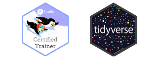

```{r setup, include=FALSE}
knitr::opts_chunk$set(echo = FALSE)
```

## Certified RStudio Instructor, tidyverse

{width=40%}

## Instructional Materials on R (ggplot2, tidyverse, shiny)

-   Zoss, Angela M. (August 1, 2019). **Visualization for data science in R**. Two-day course at [Data Matters](http://datamatters.org) Data Science Short Course Series, sponsored by the National Consortium for Data Science, The Odum Institute, and RENCI, Raleigh, NC. Topics include static visualizations with ggplot2, interactive visualizations with plotly, dashboards with RMarkdown, interactive documents and dashboards with shiny.

    -   [2019 Course Materials](https://github.com/amzoss/RVis-DM2019)

-   Zoss, Angela M. (Fall 2017 to Spring 2021). **Visualization in R using ggplot2**. Workshop at Duke University Libraries' Data and Visualization Services department workshop series, Durham, NC.

-   Zoss, Angela M. (Fall 2019). **Advanced ggplot2 techniques**. Workshop at Duke University Libraries' Data and Visualization Services department workshop series, Durham, NC.

